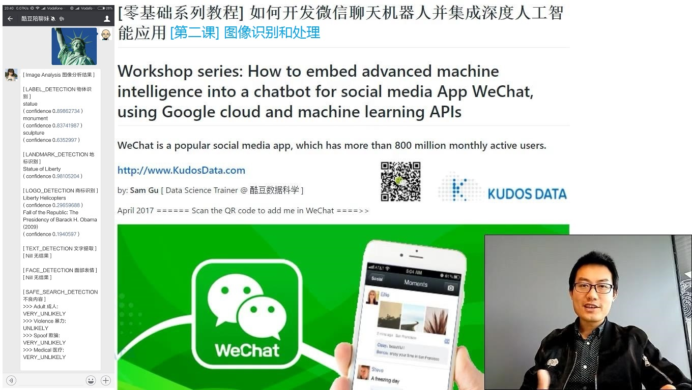
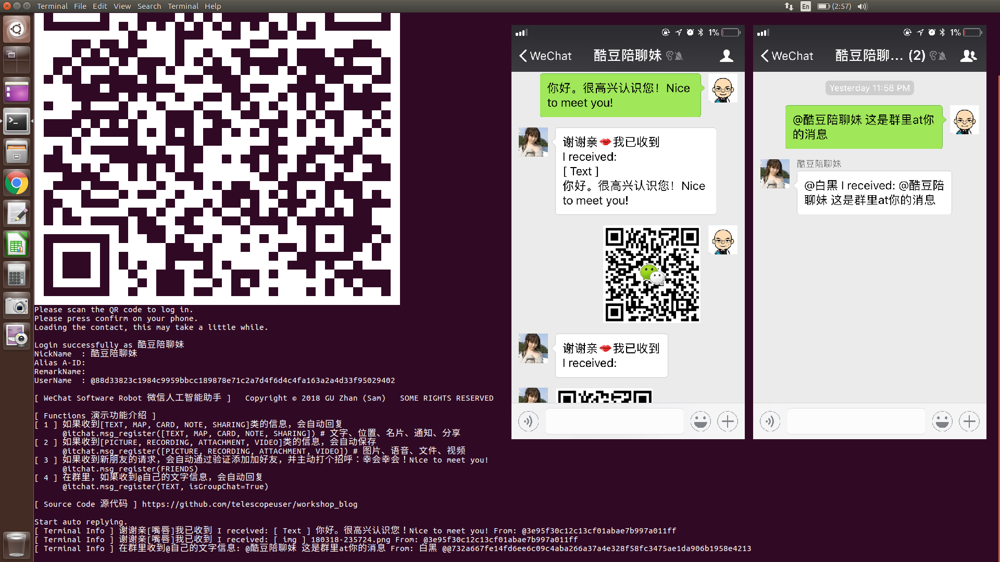
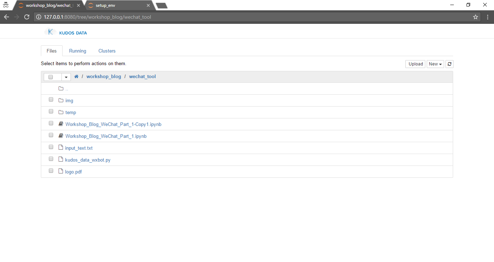
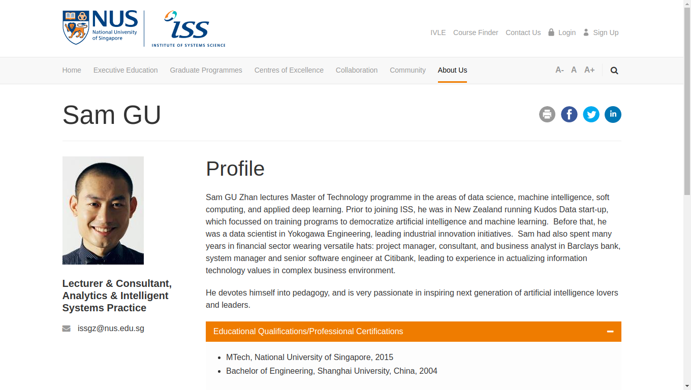

Firstly, please open this README document using your own web browser: https://github.com/telescopeuser/workshop_blog

### 配套视频教程的链接:

母国大陆
* [全部课] https://space.bilibili.com/17115905/#/video

YouTube
* [第一课] https://youtu.be/W-ZsWqcl1_c
* [第二课] https://youtu.be/FPgo-hI7OiE
* [第三课] https://youtu.be/yZV-XCSmWQY
* [第四课] https://youtu.be/4m44aPkLY2k
* [第五课] https://youtu.be/leVZjVahdKs
* [第六课] [To be announced]

# [ 零基础系列教程 ] 如何开发微信聊天机器人并集成深度人工智能应用
# Workshop series: How to embed advanced machine intelligence into a chatbot for social media App WeChat, using Google cloud and machine learning APIs

### WeChat is a popular social media app, which has more than 800 million monthly active users.

http://www.KudosData.com

by: **Sam Gu** [ Data Science Trainer @ 酷豆数据科学 ]

April 2017  ====== Scan the QR code to add me in WeChat ====>>

Acknowledgement
* 谷歌提供的云平台和机器智能引擎：https://cloud.google.com/products/machine-learning/
* ItChat工作组提供的微信程序接口：https://github.com/littlecodersh/ItChat

---

## 1. 教程大纲 Workshop Content

### 第一课：微信问答机制使用基础
### Lesson 1: Basic usage of WeChat Python API
* 使用和开发微信个人号聊天机器人：一种Python编程接口 (Use WeChat Python API)
* 用微信App "扫一扫" QR码图片来自动登录 (Log-in WeChat account)
* 查找指定联系人或群聊 (Scan contact list)
* 发送信息（文字、图片、文件、音频、视频等） (Send message: text, image, file, voice, video, etc)
* 接收信息 (Receive message, and keep 'listening')
* 自动回复 (Receive message and then automaticaly reply)
* 自定义复杂消息处理，例如：信息存档、回复群聊中被@的消息 (Advanced message processing and reply)

### 第二课：图像识别和处理
### Lesson 2: Image Recognition & Processing

* 识别图片消息中的物体名字 (Recognize objects in image)
        [1] 物体名 (General Object)
        [2] 地标名 (Landmark Object)
        [3] 商标名 (Logo Object)

* 识别图片消息中的文字 (OCR: Extract text from image)
        包含简单文本翻译 (Call text translation API)
        
* 识别人脸 (Recognize human face)
        基于人脸的表情来识别喜怒哀乐等情绪 (Identify sentiment and emotion from human face)

* 不良内容识别 (Explicit Content Detection)

### 第三课：自然语言处理：语音合成和识别
### Lesson 3: Natural Language Processing 1
* 消息文字转成语音 (Speech synthesis: text to voice)
* 语音转换成消息文字 (Speech recognition: voice to text)
* 消息文字的多语言互译 (Text based language translation)

### 第四课：自然语言处理：语义和情感分析
### Lesson 4: Natural Language Processing 2
* 消息文字中名称实体的识别 (Name-Entity detection)
* 消息文字中语句的情感分析 (Sentiment analysis, Sentence level)
* 整篇消息文字的情感分析 (Sentiment analysis, Document level)
* 语句的语法分析 (Syntax / Grammar analysis)

### 第五课：视频识别和处理
### Lesson 5: Video Recognition & Processing
* 识别视频的场景片段 (Detect shots change in video)
* 识别视频消息中的物体名字 (Recognize objects in video/shots)
* 直接搜索视频内容 (Search content in video)

### 第六课：互动智能机器人应用
### Lesson 6: Intelligent & Interactive Chat-bot Applications
* 多语言翻译器 (Language translator)
* 图文多媒体的订阅和点播 (Multi-media broadcast & on-demand subscription)
* 文章的概括和缩写 (Automatic article summary)
* 不良图片的识别；不良视频片段的自动识别和定位 (Explicit content detector: i.e. adult content or violent content)
* 基于商品图片的搜索和商家价格比较 (Best retail price finder using an image of goods)

---

## 2. 开发环境安装

### 选择1：下载使用虚拟机
### Option 1: Use a Virtual Machine to run in your own computer (Difficulty level: Easy, like being a boss)
* Download a pre-configurated Ubuntu Linux virtual machine (25 GB size), which contains all environment setup: https://github.com/telescopeuser/iss-vm
* Start the VM using Virtualbox. Free Virtualbox download: https://www.virtualbox.org/wiki/Downloads
* Click **iss-env-py3 Jupyter** icon on desktop to start Jupyter Notebook
* Choose your favorite file folder, then git clone/pull workshop_blog notebooks from Github: https://github.com/telescopeuser/workshop_blog.git

On desktop, click 'Solution WeChat Software Robot' to start the quick demo in terminal, or manually start by command:

$ python workshop_blog/wechat_tool/terminal-script-py/lesson_1_terminal_py3.py

### 选择2：使用云平台
### Option 2: Use Cloud Platform (Difficulty level: Medium, as nudging your colleague)
Create an account in Google Cloud Platform (GCP)
* Complete GCP Registration: https://cloud.google.com/free/ <--- In case you are lost here, quick guide: https://cloud.google.com/getting-started/
* Go to GCP Console: https://console.cloud.google.com/home
* Create a new project: 
  > project id: **kudosdata01** [This is uniquie GCP project-id, which you MUST change to your own id.]

  > project name: **kudosdata01** [You MAY change to your own name.]

  > zone: **asia-east1-b** [Choose a data center near your location.]
  
* Enable GCP Compute Engine API for new project, using GCP API Manager

Start Datalab (Jupyter python notebook) using Cloud Shell
* Create/Connect a GCP Compute Engine virtual machine to use Datalab: **kudosdata01-vm-datalab-workshop** <--- In case you are lost here, quick guide: https://cloud.google.com/datalab/docs/quickstarts
  
  > gcloud projects list
  
  > gcloud config set core/project **kudosdata01** [your own unique project-id]
  
  > gcloud config set compute/zone **asia-east1-b**

  > datalab create **kudosdata01-vm-datalab-workshop** --zone **asia-east1-b** [1st time for creation]

  > datalab connect **kudosdata01-vm-datalab-workshop** [2nd time for connection]

  > datalab stop **kudosdata01-vm-datalab-workshop** [stop VM after use]        
* Open Datalab in web browser, then create a new notebook from datalab folder, then run below two command in notebook cell:

  > !git clone https://github.com/telescopeuser/workshop_blog.git

  > %load workshop_blog/setup_cloud.py
        

### 选择3：本地电脑安装
### Option 3: Use your own computer (Difficulty level: High, as what you normally do)
* Install Anaconda3 (This software includes many useful tools: Python3, Jupyter Notebook, pip) https://www.continuum.io/downloads
* Install Git & Git Bash https://git-scm.com/downloads
* Install WeChat API package for Anaconda / python

  > pip install -U html
  
  > pip install -U qrcode
  
  > pip install -U itchat
  
* Download workshop python notebook code from Github: https://github.com/telescopeuser/workshop_blog.git
* Start Jupyter Notebook (Here I use Git Bash command line tool)
* Open a web browser if it's not started automatically. Go to url: http://localhost/tree

---

## 3. 恭喜您！安装成功了！下一步进入具体课程和实战操作，请打开第一课的笔记本。 Congratulations! After completing one of the installation options, you are now ready to rock! Go to GCP Datalab folder: workshop_blog/wechat_tool, open Notebook and follow...

### [ March 2018 ] What am I doing now?

Most time in thinking 'where to have lunch' while lecturing in Institute of Systems Science, National University of Singapore:

https://www.iss.nus.edu.sg/about-us/staff/detail/201/Sam%20GU

## 欢迎报考 新加坡国立大学 人工智能 硕士学位 !
## Welcome to pursue Artificial Intelligence master degree from National University of Singapore !

Image stolen from: https://www.lifegate.it/persone/stile-di-vita/falcon-heavy

> *DON'T PANIC!*

> *The History of every major Galactic Civilization tends to pass through three distinct and recognizable phases, those of Survival, Inquiry and Sophistication, otherwise known as the How, Why, and Where phases. For instance, the first phase is characterized by the question 'How can we eat?' the second by the question 'Why do we eat?' and the third by the question 'Where shall we have lunch?'*

> *from < The Restaurant at the End of the Universe > & < The Hitchhiker's Guide to the Galaxy > by Douglas Adams*
